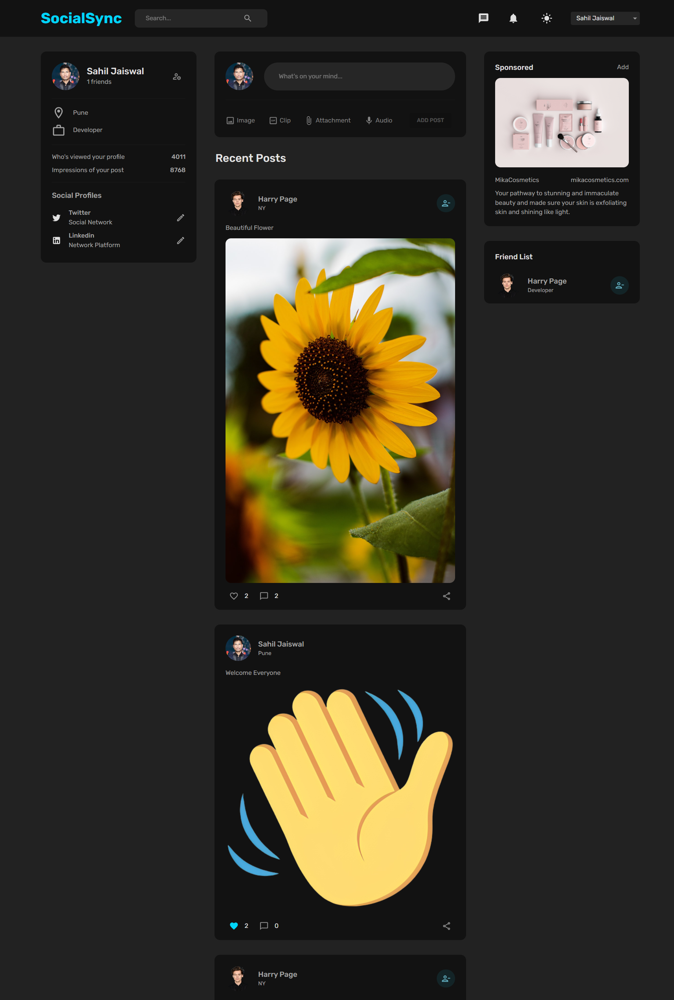
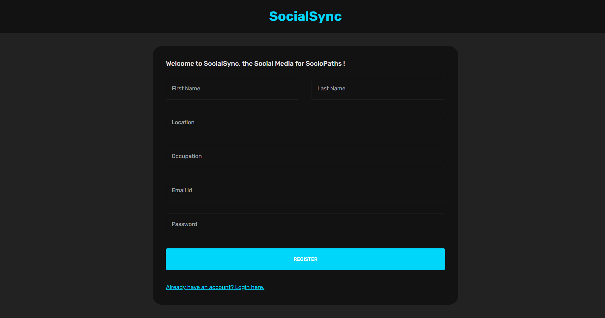
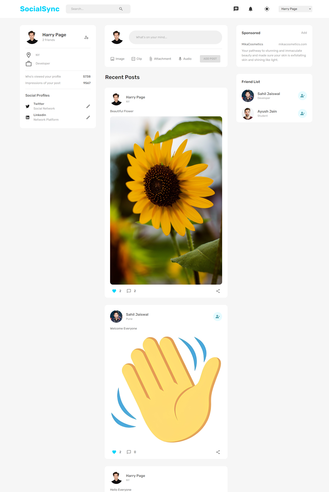
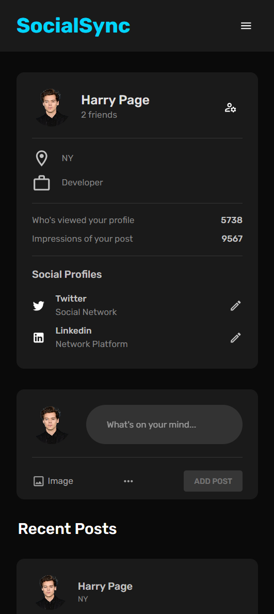

# Sociopedia

Sociopedia is a social platform web application that combines advanced development skills with a user-friendly interface, offering features similar to Twitter. 




This README provides information on setting up and running the Sociopedia project, which is organized into two main folders : `server` and `client`.
Certainly! Here's an enhanced version:

## Technologies Used

- **MERN STACK**: Leveraging the power of MongoDB, Express.js, React, and Node.js for a robust and efficient stack.
- **Powered by MUI**: Utilizing Material-UI to enhance the user interface and provide a modern and cohesive design.
- **BLACKBLAZE B2 CLOUD**: Leveraging Blackblaze B2 Cloud for reliable and scalable cloud storage.

## Features

- **Dark Mode**
- **Minimalistic Designs**
- **Fully Responsive** 
- **Chat, Comment, Like Posts**

# Configuring Project
## Server

1. Create a `.env` file in the **server** folder with the following content:

   ```dotenv
   Replace placeholder values with your actual credentials.

   # MongoDB Atlas connection string
   MONGO_URL=YOUR_MONGODB_ATLAS_CONNECTION_STRING

   # Port for the server
   PORT=3001

   # JWT secret for token generation
   JWT_SECRET=YOUR_JWT_SECRET

   # Backblaze B2 credentials
   B2_ENDPOINT=YOUR_B2_ENDPOINT
   B2_ACCESS_KEY_ID=YOUR_B2_ACCESS_KEY_ID
   B2_SECRET_ACCESS_KEY=YOUR_B2_SECRET_ACCESS_KEY
   B2_REGION=YOUR_B2_REGION
   ```

  - If you haven't set up an account on Backblaze B2 yet, you can [create one here](https://www.backblaze.com)

----

If you encounter CORS issues during deployment, ensure that the CORS policy is set up using the BlackBlaze CLI. Use the following command:

```bash
b2-windows.exe update-bucket --corsRules "[{\"corsRuleName\":\"downloadFromAnyOrigin\", \"allowedOrigins\": [\"https\"], \"allowedHeaders\": [\"range\"], \"allowedOperations\": [\"b2_download_file_by_id\", \"b2_download_file_by_name\", \"s3_delete\", \"s3_get\", \"s3_head\", \"s3_post\", \"s3_put\"], \"exposeHeaders\": [\"x-bz-content-sha1\"], \"maxAgeSeconds\": 3600}]" bucketName allPublic
```


3. Installation:

   ```bash
   cd server
   ```

   ```
   npm install
   ```

   ```
   nodemon index.js or node index.js
   ```


## Client

1. Create a `.env.local` file in the `client` folder with the following content:

   ```dotenv
   # API URL for server communication
   REACT_APP_API_URL=http://localhost:3001
   REACT_APP_CLOUD=END_POINT_BLACKBLAZE
   ```

2. Installation:

   ```bash
   cd client
   ```
   ```
   npm install
   ```
   ```
   npm start
   ```

## Contributing

Contributions to Sociopedia are welcome! Feel free to open issues or pull requests.

## License

This project is licensed under the MIT License. See the [LICENSE](LICENSE) file for details.


## Different Views





